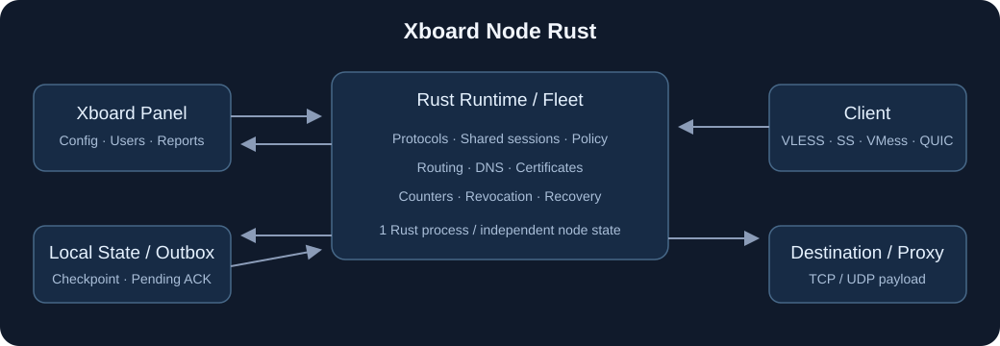

# Xboard Node Rust

[中文](README.md) · [English](README.en.md) · [Releases](https://github.com/kejixiaoqi666/xboard-node-rust/releases) · [Installation](docs/INSTALL_EN.md)

**A Rust node backend for Xboard, running on Linux VPS servers.** It reads node settings and users from a panel, authenticates clients, forwards traffic, applies user limits, and reports transferred payload bytes.

The panel manages users and subscriptions; this program runs the node. It continues the migration from [xbord-node-v3](https://github.com/xiaofujie369/xbord-node-v3). The name and installer entry point are unchanged. Local standalone configurations are also supported.

The `v0.1.0-preview.13` prerelease keeps the previously listed protocol, transport, routing, DNS, fleet and certificate modules and adds identity-checked offline recovery for the last successful panel snapshot. The default server uses Rust throughout and requires no Go, Xray or external sing-box server. New features are not a claim of complete upstream compatibility, maximum capacity or proven long-term production stability.



## Install and use

Linux AMD64/ARM64, Bash, systemd and root are required. Release binaries are static musl builds; Rust is not required on the VPS.

```bash
bash <(curl -fsSL https://raw.githubusercontent.com/kejixiaoqi666/xboard-node-rust/main/install.sh) install
xboard-rust
```

Create a panel node first. Enter the panel root URL, node ID, machine ID or legacy API type, and its Token. The installer selects the latest published compatible release using paginated publication timestamps and verifies SHA-256. Tokens are entered without echo and stored in a separate local file with mode 0600.

The menu provides install, update, configure, rollback, start/stop/restart, status, logs, version and uninstall. Use a real subscription client to verify the connection and billing. It does not create a panel, purchase a VPS, register a domain, or automatically replace an existing node service.

## Implemented capabilities

| Area | Behavior | Boundaries |
| --- | --- | --- |
| VLESS / Trojan | TCP/UDP, IPv4/IPv6/domain destinations, file TLS | Trojan requires TLS; VLESS supports plain TCP, TLS or REALITY |
| Vision / REALITY | Vision TCP/UDP and mux/XUDP; X25519/ML-KEM-768, HRR, optional ML-DSA-65, KeyUpdate | One configured SNI; interoperability is tied to the verified client versions |
| VMess | AEAD authentication, AES-128-GCM / ChaCha20-Poly1305 / none; TCP, UDP and mux | 256 users per listener; legacy AlterID is unsupported; each direction closes before its 65,536-frame nonce limit |
| Shadowsocks | 18 methods, TCP/UDP, 2022 AES/ChaCha and replay checks | AES2022: 65,536 users; traditional AEAD: 256; legacy/none/ChaCha2022: one |
| AnyTLS | TLS, padding scheme, multiple TCP streams, UoT v2 UDP | TLS required; listener-wide logical-session budget |
| Hysteria2 | QUIC/HTTP3 authentication, TCP/UDP, Salamander | v2; cubic/new_reno/bbr; TLS required |
| TUIC | UUID/password, QUIC TCP/UDP, native/unistream UDP, optional 0-RTT | v5; fresh exporter authentication and replay validation remain required |
| Transports | WebSocket, HTTP Upgrade, HTTP/2, gRPC | VLESS/VMess/Trojan; exact path/Host/service checks; no Vision/REALITY transport stacking |
| Multiplexing | Xray Mux.Cool/XUDP GlobalID; SMUX/Yamux/H2MUX and padding | Shared 8 MiB queue and 1,024 logical sessions by default; can disable or lower the limit |
| SS plugins | Native Rust v2ray-plugin WS, default mux=1 or mux=0, optional file TLS; external SIP003 | External plugins require an explicit absolute executable and administrator-supplied options |
| Routing | Domains, regex, CIDRs, ports, source IP/port, user/inbound, logical/inverted rules | Ordered rules; a failing proxy does not fall back to direct |
| Rule data | Local source JSON, V2Ray GeoIP/GeoSite `.dat`, selectors, SHA checks and atomic replacement | Remote sets and binary SRS are unsupported |
| Outbound/DNS | direct/block, SOCKS5, HTTP CONNECT, VLESS/Trojan/SS, detour chains; UDP/TCP/DoT/DoH/DoQ DNS | Capabilities follow the selected protocol; encrypted DNS verifies certificates and has no silent plaintext fallback |
| Panel/fleet | v2 machine/v1 UniProxy REST, ETag and WS resync; static fleets, multiple panels, machine discovery | Up to 64 nodes per process; distinct state/outboxes; conflicting paths/identities are rejected |
| Observability | Online IPs/connections, measured Linux host resources, machine status, local health and JSON logs | Local health is independent of panel ACK; partial readiness returns 503 |
| Certificates | file/content/self; ACME HTTP-01 and Cloudflare DNS-01, renewal and recovery | Failed renewal retains the last certificate; validation scope below |
| Configuration recovery | Each node stores its last successful panel config/user snapshot in an identity-bound private file; a restarted node can bootstrap while the panel is temporarily unavailable | Used only with no active snapshot and a transport/5xx outage; corrupt, mismatched or unauthorized responses are rejected, and a reachable panel replaces the cache |
| Accounting/operations | Stable user counters, checkpoints, immutable pending reports, reconciliation, installer and rollback | Program rollback preserves current billing state |

## Limits, credentials and accounting

One user's upload plus download across connections share `speed_limit` in Mbps. For example, 8 means approximately 1,000,000 payload bytes/second with a one-second burst and a 64 KiB minimum allowance. `device_limit` counts concurrent source IPs on this node, not physical devices or a global cross-node device count. Changing a rate keeps sessions; deleting a user or replacing its UUID/password revokes old sessions.

Only successfully forwarded application payload is counted. Authentication, address headers, frame padding and outer TLS/QUIC overhead are excluded. Inner HTTPS records are payload, so counters are not equivalent to interface bytes or decrypted file size.

Persisted frozen batches separate collection from panel delivery. If the panel may have received a request but its ACK was lost, the batch becomes `uncertain` and is not blindly resent. Reconcile the exact panel batch, then use `--traffic-resolve ... delivered|not-delivered`. The panel has no universal batch deduplication API, so end-to-end exactly-once delivery is not claimed. Forced termination can lose a tail after the latest checkpoint; zero-loss power failure is not claimed.

Shadowsocks2022 preserves the original conversion: copy UUID UTF-8 bytes into a zero-filled 16/32-byte buffer, truncate excess, then Base64. AES2022 uses `server_key:user_key`; ChaCha2022 uses the user key alone. Colliding converted keys are rejected. Legacy methods include AES-128/192/256 CTR/CFB, RC4-MD5, ChaCha20-IETF, XChaCha20 and none.

The native plugin wraps TCP; SS UDP remains native encrypted datagrams on the same public port. Example panel fields:

```json
{"plugin":"v2ray-plugin","plugin_opts":"server;mode=websocket;path=/ss;host=node.example.com;mux=1"}
```

The `tls` option needs configured file certificates. An external SIP003 child uses private loopback TCP, readiness checking and an owned process group. The standard transport loses original client IPs, so external plugins require `device_limit=0`; use the native plugin when source-IP enforcement is needed.

## Fleet, migration and certificates

A simple fleet places runtime configurations under `nodes`, each with a unique `state_dir`. `embedded=true` runs data planes within the same Rust process; existing single-node configurations can retain the separate Rust worker. Advanced fleets add panel groups, discovery, certificates, logging and health endpoints.

```bash
xboard-node-rust --import-go-yaml /path/config.yml \
  --output /etc/xboard-node-rust/fleet.json \
  --secrets-output /etc/xboard-node-rust/private.json \
  --original-cwd /original/absolute/working-directory
xboard-node-rust --config /etc/xboard-node-rust/fleet.json \
  --secrets /etc/xboard-node-rust/private.json --check
```

The importer stores secret references separately and does not launch a Go engine. Supported `xray` settings map to Rust capabilities. Unknown/unmapped settings are rejected. `--check` is offline validation; it does not prove panel reachability, certificate issuance or a working data plane.

Vision requires `xtls-rprx-vision` and outer TLS1.3 or REALITY. Generate REALITY keys using `generate-reality-keypair`; `generate-reality-mldsa65` produces the optional seed and client verification key. Private keys stay in server configuration. File and ACME certificates are validated and committed as complete generations; renewal failure retains the old pair. See [installation details](docs/INSTALL_EN.md).

## Verification and remaining boundaries

Ordinary tests, pinned official-client interoperability, Linux binary/installer lifecycle and isolated real-panel billing are separate gates. An active service or HTTP200 is not business acceptance. See [validation records](docs/VALIDATION_ZH.md) and the matching release reports.

For the final `v0.1.0-preview.12` tag, [Actions run 37154037856](https://github.com/kejixiaoqi666/xboard-node-rust/actions/runs/37154037856) passed these gates on both AMD64 and ARM64 for commit `ef0355843693c3e4738d028c8af7ab5c0f0228ce`, including the 35-case embedded fleet and 88-case systemd lifecycle reports. The hidden Flash lab also passed real embedded-runtime TCP/UDP forwarding, online/IP/resource observation, rate-2 billing, normal stop, and restart-without-replay checks using the final tag's AMD64 binary. The validation is isolated and loopback-based; it is not a WAN capacity or long-term stability claim.

Official sing-box v1.14.2 and Xray v26.3.27 clients are fixed by archive and independently verified executable hashes; they are test dependencies and are not shipped with the server. ACME issuance/renewal/recovery is tested with a real local Pebble CA. Cloudflare record ownership/cleanup uses a local mock; production public-CA/DNS writes are not claimed as verified.

Full upstream field/protocol parity, kernel splice, production WAN capacity and long-term stability are not claimed. Unsupported options include remote rule sets/SRS, gRPC multiMode, legacy VMess AlterID, Brutal and client-pool settings on an inbound. Multiplex `protocol`/`padding` describe client negotiation; supported server formats are accepted, while `enabled` and `max_streams` enforce admission policy. Software resource ceilings are rejection/recovery limits, not throughput measurements.

## Development and license

```bash
cargo test --workspace --locked -j 2
cargo clippy --workspace --all-targets --all-features --locked -j 2 -- -D warnings
cargo build -p node-runtime --release --locked -j 2
```

MPL-2.0 with retained upstream/dependency notices. No additional commercial-use, user-count or purpose restrictions are added. Selected protocol modules derive from pinned MIT sources. See [LICENSE](LICENSE) and [NOTICE.md](NOTICE.md).
