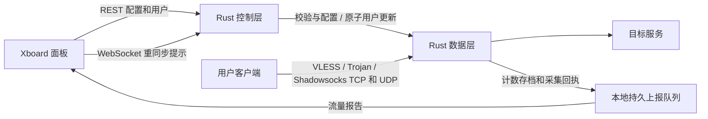

# Xboard Node Rust

[中文](README.md) · [English](README.en.md) · [下载发行版](https://github.com/kejixiaoqi666/xboard-node-rust/releases) · [安装与管理](docs/INSTALL_ZH.md)

**用 Rust 重构的 Xboard 节点后端。** 安装在 Linux VPS 上，向 Xboard 面板获取节点配置和用户列表，并提供当前已迁移的代理协议、用户同步和流量统计能力。

本项目从 [xbord-node-v3](https://github.com/xiaofujie369/xbord-node-v3) 的迁移工作继续开发，目标是保留原版的使用流程，改进运行架构、配置更新和资源管理。**`v0.1.0-preview.10` 新增 Shadowsocks 原生 Rust TCP/UDP**，覆盖传统 AEAD 三种方法和 2022 AES 两种方法；用户更新、限速、来源 IP 限制、路由和持久计数接入同一套基础能力。保留 VLESS/Trojan、REALITY、Vision TCP 与一键安装管理入口。服务端可以独立运行，完整原版功能仍在迁移。

## 先了解它做什么

如果你已经有 Xboard 面板，这个程序负责 VPS 上的“节点”部分：

1. 面板告诉节点监听哪个端口、使用什么协议，以及哪些用户可以连接。
2. 节点校验配置和用户，启动 Rust 协议数据层。
3. 客户端按面板提供的节点信息连接，节点负责认证和转发。
4. 节点同步用户变更，并向面板上报已采集的有效载荷流量。



控制层和数据层使用**同一份 Rust 可执行文件**，分别运行在两个进程中，以便单独恢复数据层。默认安装不需要 Go 工具链、Go 服务端、Xray 或外部 sing-box。

## 一键安装

支持 Linux **AMD64 / ARM64**，需要 Bash、systemd 和 root 权限。建议 Debian 12/13、Ubuntu 22.04/24.04。发行包采用静态 musl 构建；无需在 VPS 上安装 Rust 或编译源码。

在 VPS 的 root 终端执行：

```bash
bash <(curl -fsSL https://raw.githubusercontent.com/kejixiaoqi666/xboard-node-rust/main/install.sh) install
```

脚本会自动识别 CPU 架构，选择有对应文件的最新已发布版本（包括预览版），下载并校验发行包。随后依次填写：

| 输入项 | 怎么填 |
| --- | --- |
| 面板地址 | 面板根地址，例如 `https://panel.example.com`，不填管理后台路径 |
| 节点 ID | 面板中这个节点的 ID |
| 服务器 ID | 使用 Xboard v2 machine API 时填写，与节点 ID 是两个不同值 |
| legacy node_type | 仅旧节点 API 模式使用；服务器 ID 留空，再填面板要求的类型 |
| Token | 面板提供的对应认证凭据；输入隐藏，单独保存在权限为 0600 的文件 |

安装完成后运行：

```bash
xboard-rust
```

菜单提供安装、更新、配置、回退、启停、状态、日志、版本、配置检查和卸载。**服务启动成功只说明进程在运行**；仍需导入面板订阅，用实际客户端验证对应节点。

完整参数、离线安装、固定版本和常见问题见 [安装与管理指南](docs/INSTALL_ZH.md)。

## 当前支持范围

| 能力 | 当前情况 |
| --- | --- |
| VLESS TCP | 已实现；UUID 认证和 TCP 转发 |
| VLESS TCP + TLS | 已实现；使用本机已有证书与私钥文件 |
| VLESS Vision TCP | 外层文件 TLS 1.3 或 REALITY，`xtls-rprx-vision`；普通 TCP、内层 TLS 1.2/1.3，TLS 1.3 可双向直通；不含 Vision UDP、mux/XUDP |
| VLESS REALITY TCP / UDP | TCP 可带或不带 Vision；UDP 使用普通 VLESS，不带 Vision/mux/XUDP。单个 SNI、X25519、短 ID、时间/版本校验、固定站点转发、多记录 ClientHello 与客户端 KeyUpdate |
| Trojan TCP + TLS | 已实现；认证、文件 TLS 和转发 |
| VLESS / Trojan UDP | 已实现；通过协议连接转发 UDP，支持 IPv4、IPv6、域名解析和文件 TLS；普通 VLESS UDP 也支持 REALITY |
| 路由 | 域名、域名后缀、IPv4/IPv6 CIDR、目标端口/范围、TCP/UDP、来源 IP/端口；按顺序匹配 |
| 出站 | 直连、阻断、SOCKS5 TCP 上游（可用用户名/密码）；不支持 SOCKS5 UDP 或代理链 |
| DNS | 默认系统解析；可指定 UDP/TCP DNS、静态 hosts、地址族偏好、超时和共享缓存 |
| 用户限速 | `speed_limit` 按 Mbps；同一用户的连接、上传和下载共用一个预算，0 表示不限速 |
| Shadowsocks TCP / UDP | 传统 AEAD：AES-128/256-GCM、ChaCha20-IETF-Poly1305；2022：BLAKE3-AES-128/256-GCM；详见下方配置与资源边界 |
| 设备 / 来源 IP 限制 | `device_limit` 限制本节点同一用户同时活跃的不同来源 IP；同一 IP 多条连接共用名额，0 表示不限 |
| Xboard 配置与用户同步 | v2 machine / v1 legacy REST；固定一个明确的节点 ID |
| WebSocket | 可信地址校验、重连及目标节点重同步提示；实际数据重新从 REST 拉取 |
| 仅用户变更 | 原子更新认证表，保持已认证连接；删除用户阻止新认证 |
| 配置变更与恢复 | 候选预检查；监听/TLS/协议/路由变化重启数据层，错误候选保留旧服务 |
| 流量统计 | 按稳定用户身份记录成功转发的有效载荷；不是网卡总流量 |
| 持久化 | 原生周期存档、冻结快照/采集回执、持久待报队列及确认停止流程 |
| 交付与管理 | AMD64/ARM64 安装包、SHA-256 校验、systemd、升级、程序回退、配置备份 |

### Shadowsocks 怎么用

Shadowsocks 是客户端连接节点的一种协议。本版服务端包含认证、加解密和 TCP/UDP 转发，无需另外运行 Go 或 Xray 服务端。客户端仍需支持所选的加密方法。

**面板的节点响应**使用以下字段；它们不是安装时填写的本地 `runtime.json`：

```json
{
  "protocol": "shadowsocks",
  "server_port": 8388,
  "cipher": "aes-128-gcm",
  "tls": 0
}
```

| 加密方法 | 服务端密钥 | 用户密码来源 | 用户上限 |
| --- | --- | --- | --- |
| `aes-128-gcm` | 不设置 `server_key` | 面板用户 `uuid` 的原文 | 256 |
| `aes-256-gcm` | 不设置 `server_key` | 同上 | 256 |
| `chacha20-ietf-poly1305` | 不设置 `server_key` | 同上 | 256 |
| `2022-blake3-aes-128-gcm` | `server_key`：Base64 编码的 16 字节密钥 | 按原版规则转换 `uuid`，见下文 | 65,536 |
| `2022-blake3-aes-256-gcm` | `server_key`：Base64 编码的 32 字节密钥 | 同上，长度改为 32 字节 | 65,536 |

2022 模式保持原 Go 节点的用户转换：取 `uuid` 的 UTF-8 字节，复制到 16/32 字节的零填充数组，超长截断，再使用标准 Base64 编码。客户端通常使用 `server_key:转换后的用户密钥`；面板订阅生成器也必须采用同样规则。**两个不同 UUID 的前 16/32 字节相同，可能得到相同密钥**，节点会拒绝这种配置，不会让它们共用用户身份。不能直接把 UUID 原文当作 2022 客户端密码。

TCP 与 UDP 监听同一端口；启用服务器防火墙时需要分别放行。只支持普通 Shadowsocks，不叠加文件 TLS、REALITY、Vision、mux 或插件。2022 ChaCha、旧流密码、SIP003 插件和其他传输未迁移。仅用户变化可以热更新；方法、服务端密钥、端口、路由和 DNS 变化需要重启数据进程。

计数只包含实际转发的用户有效载荷，不包含 salt、加密标签、地址头和填充。TCP/UDP 共用用户速率预算和来源 IP 名额。删除用户后旧密码不能再次认证；已有 TCP 会话保留已认证身份，UDP 不再接受旧密钥的新数据包。TCP 可以使用已有 SOCKS5 上游；UDP 只支持直接或阻断路由。

资源和重放检查有明确边界：同时最多 64 个 TCP 握手、10 秒握手期限；TCP salt 缓存最多 65,536 项，保存 120 秒。传统 UDP salt 最多 65,536 项，保存 60 秒；2022 UDP 使用 1,024 包重排窗口，最多保留 4,096 个会话记录，空闲 120 秒后清除。缓存满时拒绝新项，不逐出未过期记录。UDP 最多 1,024 个活跃关联、每个关联 64 个目标；全局在途/排队数据分配预算 8 MiB，每个队列最多 8 包，关联空闲 60 秒关闭。UDP **加密后的报文**不能超过 65,507 字节，因此可用的明文长度更小。上述是软件边界，不代表实测承载量。缓存不跨重启保留，也不宣称无限时间的重放保护。

协议帧采用固定版本的 MIT `shadowsocks-rust` 库，保留完整来源与许可。为避免热更新后密钥地址复用造成 UDP 缓存误命中，本项目把该缓存改为按密钥内容比较，并限制为 4,096 项；加密前初始化 TCP/UDP 填充，防止空数据包暴露缓冲区旧内容。修改记录见 [UPSTREAM.json](vendor/shadowsocks/UPSTREAM.json)。

## 限制怎么生效

面板设置 `speed_limit=8` 时，同一用户所有连接的上传加下载共用约 **1,000,000 字节/秒** 的有效载荷预算，允许一秒突发额度，最小额度为 64 KiB。它不是每个连接各自获得 8 Mbps，也不表示网卡总流量。

`device_limit=2` 表示本节点允许同一用户同时来自两个不同的 IP。同一个路由器后共享公网 IP 的设备会算作一个来源，不能据此识别物理设备，也不是多个节点之间的全局设备计数。最后一条连接结束后释放该来源的名额。

仅用户限制变动可热更新：已有连接按新限速继续转发；降低 IP 限制时保留已有连接，拒绝超出名额的新来源。删除用户阻止新认证，已有会话保留最后观察到的限速。更换监听端口、TLS 或协议仍需重启数据层。

VLESS UDP 每个连接使用固定目标；Trojan UDP 一个连接可访问多个目标。UDP 转发走已认证的协议连接，无数据 60 秒后关闭；每个关联最多记录 64 个目标，全节点最多 1,024 个 UDP 关联。这些是资源保护上限，当前测试未证明达到上限时的性能。

### 还没有迁完的部分

REALITY 外层 PQ/HRR 扩展、Vision UDP、mux/XUDP、VMess、Shadowsocks 2022 ChaCha/旧流密码及插件、AnyTLS、TUIC、Hysteria2、其他传输方式、GeoIP/GeoSite、正则/规则集、其他代理出站、加密 DNS、单进程多节点/多面板、在线 IP 向面板上报和自动 ACME 证书管理仍未完成。**当前不能视作原版的完整替换。**

未支持的协议和配置会明确拒绝。原生 Rust 模式会执行上述非零用户限制；可选的旧外部内核适配器仍拒绝非零限制，避免没有执行却声称支持。当前 JSON 运行配置与原版 Go `config.yml` 不直接互换。面板已绑定的旧节点不会被安装器自动迁移或停掉。

文件 TLS 需要先在 VPS 上准备证书，并在面板对应配置中指定 `cert_mode=file`、`cert_file`、`key_file`。证书申请和续期由你现有的证书工具负责；此版不声称内置自动申请。

## Vision 怎么用

Vision 是 VLESS 的一种数据流方式。连接开始时使用填充；目标连接符合支持的 TLS 1.3 特征后，可切换为直接传送已经加密的内层 TLS 数据，减少一层重复加密。普通 TCP 和内层 TLS 1.2 仍通过外层 TLS 传送。它不代替证书，也不保证任何网络环境下的速度、可达性或隐蔽性。

面板下发的**节点配置**需要包含以下字段；这不是完整的本地 `runtime.json`：

```json
{
  "protocol": "vless",
  "network": "tcp",
  "tls": 1,
  "flow": "xtls-rprx-vision",
  "server_name": "node.example.com",
  "cert_config": {
    "cert_mode": "file",
    "cert_file": "/etc/letsencrypt/live/node.example.com/fullchain.pem",
    "key_file": "/etc/letsencrypt/live/node.example.com/privkey.pem"
  }
}
```

替换为 VPS 上实际的证书路径和域名。面板需能下发这些字段；客户端也要设置 VLESS、TCP、TLS、相同 UUID、正确证书域名和 `xtls-rprx-vision`。外层协商 TLS 1.3；缺少/不匹配的 flow、未知 addons、Vision UDP 或明文 Vision 会被拒绝，不会退成普通 VLESS。

Vision 继续使用已有的路由、共享限速、来源 IP 名额和持久计数。有效载荷指传给目标服务的数据：访问 HTTPS 时包含内层 TLS 记录，排除 VLESS/Vision 填充和外层 TLS 开销，并不等于网页或文件的明文大小。当前实现使用有界 Tokio 复制，**没有宣称实现内核 splice/零拷贝或提高了最大吞吐**。

回退到 preview.3 或更早版本前，先在面板去掉 Vision flow，并同步修改客户端；程序回退保留当前流量状态。客户端需要重连，已有连接不能跨版本保持。

## REALITY 怎么用

REALITY 是已支持的 VLESS 连接方式，可搭配 Vision。服务端使用 X25519 密钥、短 ID 和允许的服务器名称认证连接；不需要给节点配置证书文件。普通 TLS 访问或认证未通过的连接只会转发到管理员配置的固定目标站点，不会获得代理转发权限。这不保证公网可达性、隐蔽性或性能。

先在已安装节点上生成一对密钥：

```bash
/usr/local/lib/xboard-node-rust/current/bin/xboard-node-rust generate-reality-keypair
```

命令输出 `private_key` 和 `public_key`。私钥填在面板的服务端配置里，公钥提供给客户端；不要把私钥放进客户端订阅。以下是**面板下发的节点配置字段**，需要与你的面板实际支持的配置界面对应；不是完整的本地 `runtime.json`：

```json
{
  "protocol": "vless",
  "network": "tcp",
  "tls": 2,
  "flow": "xtls-rprx-vision",
  "server_name": "www.example.com",
  "tls_settings": {
    "private_key": "替换为生成的私钥",
    "public_key": "替换为对应公钥，也可省略此服务端校验字段",
    "short_id": "1234567890abcdef",
    "server_name": "www.example.com",
    "dest": "www.example.com:443",
    "max_time_diff": 300000
  }
}
```

示例域名是占位符，替换成从 VPS 可连接、支持 TLS 1.3 和 X25519 的实际目标站点。`server_name` 是唯一允许的客户端 SNI；`dest` 是固定转发目标，可填写域名或 IP 加端口，IPv6 使用 `[地址]:端口`。省略 `dest` 时使用 `server_name` 和 `server_port`（默认 443）。外层 `server_name` 若提供，必须与内部一致；REALITY 不与 `cert_config` 混用。客户端通常填写 VLESS、TCP、REALITY、相同 UUID、公钥、短 ID、服务器名称，以及 `xtls-rprx-vision`。Xray v26.3.27 的客户端公钥字段可用 `password`；其他客户端请按其界面字段填写。

`short_id` 接受偶数长度的十六进制字符串（0–16 个字符），或最多 16 个这样的字符串组成的列表；短于 16 字符时向右补零。省略或空字符串表示允许空短 ID。`max_time_diff` 为毫秒，默认 300000，最大 3600000；0 表示关闭时间差检查。可用三字节数组 `min_client_version` / `max_client_version` 限制客户端版本；VPS 和客户端的时间应正确。服务端可省略 `public_key`；若填写则必须对应私钥。

本版支持 **VLESS REALITY TCP（带或不带 Vision）和普通 VLESS REALITY UDP（不带 Vision/mux/XUDP）**。普通 UDP 必须从面板和客户端同时去掉 flow；配置为 Vision 的用户不会接受普通 UDP。客户端关闭 mux/XUDP，使用固定目标的普通 VLESS UDP。Xray v26.3.27 默认 cone 模式可能转成 XUDP；本项目使用该版本的官方开关 `XRAY_CONE_DISABLED=true xray run -c config.json` 做兼容验收。其他客户端需确认使用普通 VLESS UDP；不能将这个开关当作所有版本、所有客户端通用配置。REALITY 认证后，代理有效载荷继续经过既有的目标路由、共享限速、来源 IP 限制和持久计数；固定目标站点的认证前转发使用同一有界 DNS 解析器，然后直接连接，不走用户的 SOCKS5 规则，也不算入用户代理流量。目标配置变化会更换数据进程并断开连接。

ClientHello 可以分成最多 16 个 TLS 记录，重组后的握手消息最多 16 KiB；认证使用重组消息，固定目标站点仍收到原始记录。完整单记录走共享缓冲快速路径，未据此宣称整体性能提升。目标站点须直接返回非 HRR 的 TLS 1.3 ServerHello；不满足时只能转发目标站点或拒绝，不能作为 REALITY 代理使用。外层客户端 KeyUpdate 已支持 `update_not_requested` / `update_requested`：每方向独立派生新密钥并归零记录序号；请求应答使用旧发送密钥，后续数据使用新密钥。KeyUpdate 可分片但总消息固定 5 字节且必须在记录边界结束；非法值、交错消息及未知握手后消息拒绝。发送受阻时暂停继续读取，应答会主动 flush，不需要应用先发送数据。服务端现在按发送的加密记录数主动轮换，更新消息使用 `update_not_requested`，不会要求客户端同时换钥匙。`tls_settings.key_update_after_records` 默认为 1048576，可设置为 16–1048576；0、超界或非整数配置拒绝。这个数量是每代发送密钥下的非 KeyUpdate 记录上限，更新消息额外占用一个旧密钥记录；单次大写入跨阈值时也会按记录切开。只在下一次需要发送数据或关闭通知时轮换，空闲连接没有定时器；接收密钥继续由客户端更新控制。Vision 切入 DIRECT 后的数据不再使用这一外层 TLS 记录机制；**内层** TLS HRR 已有实际客户端回归。握手总时限 10 秒，镜像握手最多 16 个记录/64 KiB，认证前转发最长 300 秒；记录和缓冲都有上限，超限关闭。转发由节点连接任务持有，服务停止会一起取消。这些是实现边界，不是承载能力或抗探测证明。

回退 preview.8 或更早版本前，先删除新增的 `key_update_after_records` 配置字段；旧版仍拒绝未知字段，且不会主动按记录轮换。回退 preview.7 还需避免客户端 KeyUpdate。

回退 preview.6 前应停止使用 REALITY UDP 和多记录 ClientHello 客户端；旧程序不会自动转换这些能力。回退到 preview.5 或更早版本前，需要先把面板和客户端改为对应旧版支持的文件 TLS 或普通 VLESS；只切换程序版本不会自动转换 REALITY 配置。

## 路由与 DNS 怎么用

例如，你可以让某些域名走 SOCKS5 上游，拒绝访问某个 IP 段，其他请求继续直连。配置只影响用户代理流量，不改变控制层访问 Xboard 面板的路线。

### 自定义 DNS

把以下 `dns` 字段合并到 `/etc/xboard-node-rust/runtime.json`，保留原来的面板地址、节点 ID 等字段；修改前先备份文件。省略 `dns` 或让 `servers` 为空时使用系统解析。

```json
{
  "dns": {
    "servers": ["1.1.1.1:53", "8.8.8.8:53"],
    "tcp_only": false,
    "strategy": "prefer_ipv4",
    "timeout_ms": 3000,
    "cache_size": 1024,
    "hosts": {"internal.example.com": ["192.0.2.10"]}
  }
}
```

随后执行 `xboard-rust check` 和 `xboard-rust restart`。`192.0.2.10` 是文档示例地址，应换成你的目标 IP。DNS 服务器可填 IPv4 或 `[IPv6]:端口`；默认使用 UDP，截断响应可转 TCP；`tcp_only=true` 强制 TCP。`strategy` 可选 `prefer_ipv4`、`prefer_ipv6`、`ipv4_only`、`ipv6_only`，只约束域名解析结果，不改变客户端直接指定的 IP。

`hosts` 优先于网络查询。指定 DNS 后，不再暗中回退到系统 DNS。自定义解析器跨连接共享缓存，按服务器 TTL 过期，正向最长 300 秒、负向最长 30 秒；`cache_size` 是缓存响应数量，0 关闭缓存。系统解析的缓存由操作系统管理。最多 8 个 DNS 服务器、4,096 个 hosts 条目、每次最多 32 个结果；每个数据进程同时最多 256 个网络查询，超限请求失败。DNS 超时范围为 100–10,000 毫秒，TCP 握手与连接建立另有总时限。

系统 DNS 使用独立的 2 个工作线程和 64 个等待位置，不占用流量落盘线程。解析超时会结束客户端等待；已经进入操作系统的解析调用仍占用名额，直到实际返回，避免反复超时积累无限任务。自定义解析器按 RFC 处理 `localhost` 等特殊名称，可能在本地给出结果；若要禁止回环/私网访问，仍需显式配置 IP 路由规则。

### 面板下发的分流规则

以下是节点配置接口里的字段示例，不是整个 `runtime.json`。面板需能下发这些高级字段；本项目不自动给面板新增编辑界面。

```json
{
  "custom_outbounds": [
    {"tag": "upstream", "protocol": "socks", "settings": {
      "server": "192.0.2.20", "server_port": 1080
    }}
  ],
  "custom_routes": [
    {"domain_suffix": ["blocked.example"], "outbound": "block"},
    {"ip_cidr": ["10.0.0.0/8"], "outbound": "block"},
    {"domain": ["proxy.example"], "network": ["tcp"], "outbound": "upstream"}
  ]
}
```

SOCKS5 服务器目前必须填写 IP；`settings` 可同时添加 `username` 和 `password`。SOCKS5 本身不加密凭据，使用可信链路。域名先在本节点解析，规则检查通过的**同一个 IP**用于直连或交给 SOCKS5，避免再次解析后绕过 IP 规则。命中代理规则的 UDP 会被拒绝，不会变成直连。VLESS UDP 在关联开始时选定目标；Trojan UDP 逐包选择目标，阻断或解析失败会关闭该关联。

规则优先级为 `custom_route_rules` → `custom_routes` → `routes`，每组保持原有顺序，首条命中生效，未命中默认直连。此预览版不隐式插入私网屏蔽规则；需要时显式设置 CIDR 规则。

| 字段 | 匹配与动作 |
| --- | --- |
| `routes` | `match` 中域名按后缀匹配，支持 `*.example.com`、裸 IP 和 CIDR；`action` 为 `direct`、`block`/`reject`，或 `proxy` 配合 `action_value` 出站标签 |
| `custom_route_rules` | 保留原版结构化规则的 **OR**：`domains`、`domain_suffixes`、`ip_cidrs`、`ports`、`networks`、`source_cidrs`、`source_ports` 任一组命中即可；`disabled=true` 跳过 |
| 结构化动作 | `action.type` 为 `direct`、`block` 或 `route`；仅 `route` 使用 `action.target` 指定出站标签 |
| `custom_routes` | 支持上例字段及 `port`、`port_range`、`source_ip_cidr`、`source_port`、`source_port_range`；地址条件之间 OR，与端口/网络/来源条件之间 AND；空条件为全匹配 |
| 端口与域名 | 单端口或 `80:90` / `80-90` 范围；域名忽略大小写和末尾点，后缀按标签边界匹配，`badexample.com` 不属于 `example.com` |

最多 4,096 条编译后规则、16,384 个匹配值、256 个出站。面板路由变化通过预检查后更换数据进程，会断开已有连接；仅用户更新继续热生效。本地 DNS 修改需要重启整个服务。回退到 preview.1/2 前需删除新增路由、出站和 DNS 字段，并使用该版本支持的用户限制。

## 日常管理

| 命令 | 用途 |
| --- | --- |
| `xboard-rust status` | 查看本服务状态 |
| `xboard-rust logs` | 查看最近 100 条服务日志 |
| `xboard-rust configure` | 重新填写面板/节点配置；保留私有备份 |
| `xboard-rust update` | 下载对应架构的新版本，保留配置及流量状态 |
| `xboard-rust update --version v0.1.0-preview.2` | 选择指定版本 |
| `xboard-rust rollback` | 切回上一程序；相同状态格式才允许切换 |
| `xboard-rust start / stop / restart` | 启动、停止或重启本服务 |
| `xboard-rust check` | 本地运行配置检查，不验证真实面板或协议 |
| `xboard-rust version` | 查看发行元数据与实际二进制校验值 |
| `xboard-rust traffic-status` | 停机后查看本地待报队列 |
| `xboard-rust uninstall` | 移除服务和命令入口，保留配置、凭据、状态及历史程序 |

升级时先验证候选程序与当前配置，服务停止后切换程序链接；启动检查失败会恢复旧程序并尝试启动旧服务。程序回退不撤销面板计费，也不把流量状态回到历史时间点。回退 preview.1 前，面板需使用旧版支持的配置，包括零限速、零设备限制和 TCP；实际跨版测试使用这个双方支持的配置。首次安装失败会保留文件供排查，使用 `logs` 查看原因。

| 本地位置 | 内容 |
| --- | --- |
| `/etc/xboard-node-rust/runtime.json` | 面板地址、节点身份、轮询间隔等；不存 token |
| `/etc/xboard-node-rust/panel.env` | 面板 token；0600，systemd 读取，不直接 `source` |
| `/etc/xboard-node-rust/backups/` | 修改配置前的私有备份，包含旧凭据 |
| `/var/lib/xboard-node-rust/` | 原生计数、控制文件和流量上报状态 |
| `/usr/local/lib/xboard-node-rust/releases/` | 已校验的程序版本与许可文件 |
| `xboard-node-rust.service` | 本项目自己的 systemd 服务 |

安装器不修改防火墙、BBR 或其他节点服务。请按面板配置放行实际使用的 TCP 端口。

## 架构与优化

| Rust 模块 | 职责 |
| --- | --- |
| `node-core` | 配置/用户模型、校验、身份哈希与状态转换 |
| `node-panel` | REST、ETag、wire 转换、WS 地址及重连 |
| `node-kernel` | 流式生成配置、预检查、生命周期和用户更新控制 |
| `node-native` | VLESS/Trojan、Rustls、认证快照、TCP/UDP、路由/DNS/SOCKS5、共享限速、来源 IP 名额与计数 |
| `node-runtime` | 串行同步、事务提交、恢复、持久上报队列和停止协调 |

已完成的优化包括借用式流式配置序列化、编码后大小限制、控制层单线程异步执行、有界磁盘工作、认证快照热更新和 release 体积配置。优化数据按对应源码、内核和负载记录；不会把有限协议的 Rust 子集与全功能 Go 程序直接比较，得出“语言一定更快”的结论。

## 验证情况与边界

迁移基线已在 Windows/Linux 检查格式、测试与严格 clippy；Linux ARM64 基线通过真实协议/TLS、用户更新、故障恢复、流量字节对账和持久化案例。历史 GNU 二进制、测量环境与对应哈希保留在技术报告中，**不代表此发行版的 musl 文件使用同一个二进制哈希**。

此发行版构建流程分别编译 AMD64/ARM64，验证包校验、文件权限、配置保留、程序切换/回退、异常拒绝和卸载。全新 systemd 安装使用回环模拟面板和真实 TCP/TLS/UDP 回显，覆盖不同目标端口、域名、IPv6、空包和 65,507 字节数据包，并计时验证两条连接的双向共享限速、IP 名额和不重启的用户策略更新。另使用已公开的 preview.1 实际二进制验证升级及双向回退，核对配置和原生计数身份保留。具体结果与测量随 Release 附带 `installer-tests-*.json` 与 `systemd-tests-*.json`。

文件 TLS 和 REALITY 的 Vision 验收使用固定版本的官方 Xray **客户端**连接实际安装的 AMD64/ARM64 Rust 服务端：普通 TCP、内层 TLS 1.2/1.3、真实 HelloRetryRequest 后的 TLS 1.3、双向 DIRECT 指令与内容一致性、缺 flow/错 UUID 拒绝。还覆盖 512 字节传输缓冲、分片 UUID、类 TLS 尾部和只有 TLS close_notify 的半关闭。REALITY 还验证普通 TLS 探测的固定站点转发、错误短 ID 不连接代理目标、不带 Vision 的 VLESS。本轮还将 ClientHello 拆成六个 TLS 记录，在官方客户端下重复 TCP/Vision、DIRECT/内层 HRR 和认证拒绝矩阵。REALITY UDP 覆盖 IPv4、域名、IPv6、1/37/8,000 字节、错误身份、阻断路由与 Vision flow 拒绝、活跃关联停服及重新连接，并将模拟面板已确认报告与本地待报队列合并，对账每方向 24,188 字节有效载荷。该官方客户端的 SOCKS 层丢弃空包并使用 8,192 字节缓冲，因此这些测试不证明 REALITY 空包或 65,507 字节极限；前述空包/最大包回归属于文件 TLS。每架构附带 18 个安装器案例和 60 个实际 systemd 案例。本轮另使用官方 Xray 完成真实 REALITY 握手，再由仅在回环测试中运行的 TLS 记录适配器注入 3 次外层 KeyUpdate（含 5 记录分片），验证 2 次请求应答及双向各 98,340 字节内容一致；非法更新被拒绝且不连接目标。该结果不等于未经修改的官方客户端主动发出 KeyUpdate。测试密钥只存在于权限受限的临时目录，退出后删除，不进入报告或发行包。另外把服务端阈值设为 16，使用未经修改的官方 Xray 客户端持续回传双向各 262,240 字节；测试旁路只观察记录并原样转发密文，核对至少三次主动轮换、每代上限和完整回传。官方客户端和 Python cryptography 仅供测试，不随服务端包交付，也不是服务端依赖。

Shadowsocks 验收使用同一固定官方 Xray 客户端连接实际安装的 Rust 服务端，逐一核对五种加密方式的多帧 TCP、UDP IPv4/域名/IPv6、分段固定头、错误 TCP/UDP 密码拒绝与停止后的有效载荷字节对账。独立 AEAD 报文还覆盖重放、坏标签和路由阻断，热换用户核对进程 PID 保持。库层回归覆盖空/8,000 字节 UDP、旧缓冲区填充泄露和同一凭据转给新用户后的计数归属。

重要边界：未落盘的强杀尾部仍可能丢失；周期存档不是断电零丢失保证。上报结果不明时保留队列并暂停该批次，需要与面板记录核对；接口接收确认不等于实际计费数据库已对账。当前测试不证明公网最大吞吐、TCP 极限、长期生产稳定性或与真实面板的完整兼容。

技术细节： [迁移清单](docs/RUST_MIGRATION_ZH.md) · [Rust 数据层](docs/RUST_NATIVE_KERNEL_ZH.md) · [流量语义](docs/RUST_TRAFFIC_ZH.md) · [持久化与停止协议](docs/RUST_NATIVE_DURABILITY_ZH.md) · [历史内存优化](docs/RUST_MEMORY_OPTIMIZATION_ZH.md)。

## 从源码构建

Rust 版本固定为 `1.98.1`，依赖由 `Cargo.lock` 锁定。

```bash
git clone https://github.com/kejixiaoqi666/xboard-node-rust.git
cd xboard-node-rust
cargo build -p node-runtime --release --locked
./target/release/xboard-node-rust --help
```

检查命令：

```bash
cargo fmt --all -- --check
cargo test --workspace --locked -- --test-threads=1
cargo clippy --workspace --all-targets --all-features --locked -- -D warnings
```

Windows 可以进行模块构建和测试；默认原生数据层需要 Unix 控制 socket，本版一键部署仅支持 Linux。

本地模拟面板可以显式配置 `allow_loopback_http=true` 使用回环 HTTP；默认仍要求 HTTPS。安装器只在 literal 回环 IP 的 HTTP 地址下设置该选项。远程 HTTP 地址会被拒绝。

## 开源与来源

本项目遵循 **[MPL-2.0](LICENSE)**，保留原版来源及许可证，没有额外添加用途或商业使用限制。Vision 和 REALITY 子模块采用其原始 **MIT** 许可，保留 [cfal/shoes](https://github.com/cfal/shoes) 的版权和来源；Shadowsocks 加密与帧依赖保留 MIT 许可；其余自有模块遵循 MPL-2.0。运行包包含该子模块、第三方依赖与 Rust/musl 工具链的许可说明。

感谢 [xbord-node-v3](https://github.com/xiaofujie369/xbord-node-v3)、[xboard-node](https://github.com/cedar2025/xboard-node)、Xboard 及 Rust 生态的相关项目。详细来源见 [NOTICE.md](NOTICE.md)。
