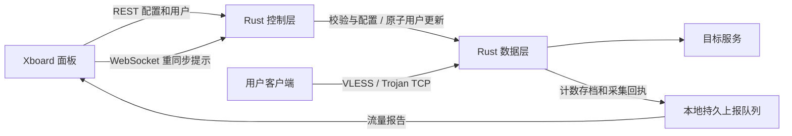

# Xboard Node Rust

[中文](README.md) · [English](README.en.md) · [下载发行版](https://github.com/kejixiaoqi666/xboard-node-rust/releases) · [安装与管理](docs/INSTALL_ZH.md)

**用 Rust 重构的 Xboard 节点后端。** 安装在 Linux VPS 上，向 Xboard 面板获取节点配置和用户列表，并提供当前已迁移的代理协议、用户同步和流量统计能力。

本项目从 [xbord-node-v3](https://github.com/xiaofujie369/xbord-node-v3) 的迁移工作继续开发，目标是保留原版的使用流程，改进运行架构、配置更新和资源管理。当前发布为 **`v0.1.0-preview.1` 预览版**：Rust 服务端已能独立运行，一键安装和管理入口已提供，完整原版功能仍在迁移。

## 先了解它做什么

如果你已经有 Xboard 面板，这个程序负责 VPS 上的“节点”部分：

1. 面板告诉节点监听哪个端口、使用什么协议，以及哪些用户可以连接。
2. 节点校验配置和用户，启动 Rust 协议数据层。
3. 客户端按面板提供的节点信息连接，节点负责认证和转发。
4. 节点同步用户变更，并向面板上报已采集的有效载荷流量。



控制层和数据层使用**同一份 Rust 可执行文件**，分别运行在两个进程中，以便单独恢复数据层。默认安装不需要 Go 工具链、Go 服务端、Xray 或外部 sing-box。

## 一键安装

支持 Linux **AMD64 / ARM64**，需要 Bash、systemd 和 root 权限。建议 Debian 12/13、Ubuntu 22.04/24.04。发行包采用静态 musl 构建；无需在 VPS 上安装 Rust 或编译源码。

在 VPS 的 root 终端执行：

```bash
bash <(curl -fsSL https://raw.githubusercontent.com/kejixiaoqi666/xboard-node-rust/main/install.sh) install
```

脚本会自动识别 CPU 架构，选择有对应文件的最新已发布版本（包括预览版），下载并校验发行包。随后依次填写：

| 输入项 | 怎么填 |
| --- | --- |
| 面板地址 | 面板根地址，例如 `https://panel.example.com`，不填管理后台路径 |
| 节点 ID | 面板中这个节点的 ID |
| 服务器 ID | 使用 Xboard v2 machine API 时填写，与节点 ID 是两个不同值 |
| legacy node_type | 仅旧节点 API 模式使用；服务器 ID 留空，再填面板要求的类型 |
| Token | 面板提供的对应认证凭据；输入隐藏，单独保存在权限为 0600 的文件 |

安装完成后运行：

```bash
xboard-rust
```

菜单提供安装、更新、配置、回退、启停、状态、日志、版本、配置检查和卸载。**服务启动成功只说明进程在运行**；仍需导入面板订阅，用实际客户端验证对应节点。

完整参数、离线安装、固定版本和常见问题见 [安装与管理指南](docs/INSTALL_ZH.md)。

## 当前支持范围

| 能力 | 当前情况 |
| --- | --- |
| VLESS TCP | 已实现；UUID 认证和 TCP 转发 |
| VLESS TCP + TLS | 已实现；使用本机已有证书与私钥文件 |
| Trojan TCP + TLS | 已实现；认证、文件 TLS 和转发 |
| Xboard 配置与用户同步 | v2 machine / v1 legacy REST；固定一个明确的节点 ID |
| WebSocket | 可信地址校验、重连及目标节点重同步提示；实际数据重新从 REST 拉取 |
| 仅用户变更 | 原子更新认证表，保持已认证连接；删除用户阻止新认证 |
| 配置变更与恢复 | 候选预检查；监听/TLS/协议变化仍需停止并重启数据层 |
| 流量统计 | 按稳定用户身份记录成功转发的有效载荷；不是网卡总流量 |
| 持久化 | 原生周期存档、冻结快照/采集回执、持久待报队列及确认停止流程 |
| 交付与管理 | AMD64/ARM64 安装包、SHA-256 校验、systemd、升级、程序回退、配置备份 |

### 还没有迁完的部分

REALITY、Vision、UDP/mux、VMess、Shadowsocks、AnyTLS、TUIC、Hysteria2、非 TCP 传输、自定义路由/出站/DNS、限速、设备/IP 限制、单进程多节点/多面板和自动 ACME 证书管理仍未完成。**当前不能视作原版的完整替换。**

未支持的协议、非零限制或配置会明确拒绝，不会为了“成功启动”悄悄忽略这些设置。当前 JSON 运行配置与原版 Go `config.yml` 不直接互换。面板已绑定的旧节点不会被安装器自动迁移或停掉。

文件 TLS 需要先在 VPS 上准备证书，并在面板对应配置中指定 `cert_mode=file`、`cert_file`、`key_file`。证书申请和续期由你现有的证书工具负责；此版不声称内置自动申请。

## 日常管理

| 命令 | 用途 |
| --- | --- |
| `xboard-rust status` | 查看本服务状态 |
| `xboard-rust logs` | 查看最近 100 条服务日志 |
| `xboard-rust configure` | 重新填写面板/节点配置；保留私有备份 |
| `xboard-rust update` | 下载对应架构的新版本，保留配置及流量状态 |
| `xboard-rust update --version v0.1.0-preview.1` | 选择指定版本 |
| `xboard-rust rollback` | 切回上一程序；相同状态格式才允许切换 |
| `xboard-rust start / stop / restart` | 启动、停止或重启本服务 |
| `xboard-rust check` | 本地运行配置检查，不验证真实面板或协议 |
| `xboard-rust version` | 查看发行元数据与实际二进制校验值 |
| `xboard-rust traffic-status` | 停机后查看本地待报队列 |
| `xboard-rust uninstall` | 移除服务和命令入口，保留配置、凭据、状态及历史程序 |

升级时先验证候选程序与当前配置，服务停止后切换程序链接；启动检查失败会恢复旧程序并尝试启动旧服务。程序回退不撤销面板计费，也不把流量状态回到历史时间点。首次安装失败会保留文件供排查，使用 `logs` 查看原因。

| 本地位置 | 内容 |
| --- | --- |
| `/etc/xboard-node-rust/runtime.json` | 面板地址、节点身份、轮询间隔等；不存 token |
| `/etc/xboard-node-rust/panel.env` | 面板 token；0600，systemd 读取，不直接 `source` |
| `/etc/xboard-node-rust/backups/` | 修改配置前的私有备份，包含旧凭据 |
| `/var/lib/xboard-node-rust/` | 原生计数、控制文件和流量上报状态 |
| `/usr/local/lib/xboard-node-rust/releases/` | 已校验的程序版本与许可文件 |
| `xboard-node-rust.service` | 本项目自己的 systemd 服务 |

安装器不修改防火墙、BBR 或其他节点服务。请按面板配置放行实际使用的 TCP 端口。

## 架构与优化

| Rust 模块 | 职责 |
| --- | --- |
| `node-core` | 配置/用户模型、校验、身份哈希与状态转换 |
| `node-panel` | REST、ETag、wire 转换、WS 地址及重连 |
| `node-kernel` | 流式生成配置、预检查、生命周期和用户更新控制 |
| `node-native` | VLESS/Trojan、Rustls、认证快照、TCP 转发与原生计数 |
| `node-runtime` | 串行同步、事务提交、恢复、持久上报队列和停止协调 |

已完成的优化包括借用式流式配置序列化、编码后大小限制、控制层单线程异步执行、有界磁盘工作、认证快照热更新和 release 体积配置。优化数据按对应源码、内核和负载记录；不会把有限协议的 Rust 子集与全功能 Go 程序直接比较，得出“语言一定更快”的结论。

## 验证情况与边界

迁移基线已在 Windows/Linux 检查格式、测试与严格 clippy；Linux ARM64 基线通过真实协议/TLS、用户更新、故障恢复、流量字节对账和持久化案例。历史 GNU 二进制、测量环境与对应哈希保留在技术报告中，**不代表此发行版的 musl 文件使用同一个二进制哈希**。

此发行版构建流程会分别编译 AMD64/ARM64，验证包校验、文件权限、配置保留、程序切换/回退、异常拒绝和卸载；另外执行一次全新 systemd 安装，以回环模拟面板和真实 VLESS/Trojan TCP/TLS 转发验证运行链路。具体结果随 Release 附带 `installer-tests-*.json` 与 `systemd-tests-*.json`。

重要边界：未落盘的强杀尾部仍可能丢失；周期存档不是断电零丢失保证。上报结果不明时保留队列并暂停该批次，需要与面板记录核对；接口接收确认不等于实际计费数据库已对账。当前测试不证明公网最大吞吐、TCP 极限、长期生产稳定性或与真实面板的完整兼容。

技术细节： [迁移清单](docs/RUST_MIGRATION_ZH.md) · [Rust 数据层](docs/RUST_NATIVE_KERNEL_ZH.md) · [流量语义](docs/RUST_TRAFFIC_ZH.md) · [持久化与停止协议](docs/RUST_NATIVE_DURABILITY_ZH.md) · [历史内存优化](docs/RUST_MEMORY_OPTIMIZATION_ZH.md)。

## 从源码构建

Rust 版本固定为 `1.98.1`，依赖由 `Cargo.lock` 锁定。

```bash
git clone https://github.com/kejixiaoqi666/xboard-node-rust.git
cd xboard-node-rust
cargo build -p node-runtime --release --locked
./target/release/xboard-node-rust --help
```

检查命令：

```bash
cargo fmt --all -- --check
cargo test --workspace --locked -- --test-threads=1
cargo clippy --workspace --all-targets --all-features --locked -- -D warnings
```

Windows 可以进行模块构建和测试；默认原生数据层需要 Unix 控制 socket，本版一键部署仅支持 Linux。

本地模拟面板可以显式配置 `allow_loopback_http=true` 使用回环 HTTP；默认仍要求 HTTPS。安装器只在 literal 回环 IP 的 HTTP 地址下设置该选项。远程 HTTP 地址会被拒绝。

## 开源与来源

本项目遵循 **[MPL-2.0](LICENSE)**，保留原版来源及许可证，没有额外添加用途或商业使用限制。运行包包含第三方依赖与 Rust/musl 工具链的许可说明。

感谢 [xbord-node-v3](https://github.com/xiaofujie369/xbord-node-v3)、[xboard-node](https://github.com/cedar2025/xboard-node)、Xboard 及 Rust 生态的相关项目。详细来源见 [NOTICE.md](NOTICE.md)。
