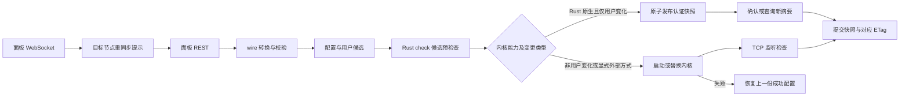

# Rust 重构进度与接续说明

> 本页保留源项目的阶段迁移记录。独立公开仓库的安装、目录和支持范围以 [当前首页](../README.md) 与 [接续入口](../HANDOFF_RUST.md) 为准；原 Go 代码、过渡内核和本机账本留在来源项目，不包含在此仓库。历史 GNU 构建证据不能替代新 musl 发行文件的校验值。

截至 2026-10-02，已有 Rust 模块已接成实验性的单节点程序 `xboard-node-rust`。已补齐运行入口、REST 同步、WebSocket 重同步提示、同端口更新与失败恢复，并完成 Windows 本地及美国服务器上的 Linux ARM64 构建和真实 VLESS 客户端验证。

目前默认协议执行也已迁入 Rust：`node-native` 的 VLESS/Trojan TCP、文件 TLS、认证与转发包含在同一份 Rust 二进制中。不填写外部程序路径即使用 Rust `run/check` 子模式。已经补齐有效载荷统计、原生计数周期存档、持久采集回执/上报队列与确认停止协议。真实面板计费、限速、设备限制、其他协议、多节点和完整路由尚未完成。原 Go 安装器与历史外部内核保留；当前验收入口为 [原生持久化与停止协议](RUST_NATIVE_DURABILITY_ZH.md)。

## 来源和恢复入口

- GitHub 参考版本：`xiaofujie369/xbord-node-v3`，Go 基线 `7893713344d301b07978c2c1e84d848181b20e39`。
- Rust 交付包：`xbord-node-v3-rust-a6255b9.tar.gz`。
- 交付包 SHA-256：`714203fc340cb423503f54416a42b36e54c5a1ea85c5b55232e0fe72e637196f`，已与附件校验文件核对。
- 只导入交付包新增的 Rust 文件，保留主分支后续 Go 修复；没有覆盖生产实例。
- 原始迁移思路保留在 `.hermes/plans/2026-09-30_211500-rust-rewrite.md`，作为历史设计资料。
- 后续工作先读 `.Codex/context-checkpoint.md` 和 `.Codex/project-ops/state.json`，再核对源码与 Git diff。源代码交付包不包含本地证据目录，接手时以本文件和 `HANDOFF_RUST.md` 为入口。

## 当前结构

| 模块 | 职责 |
| --- | --- |
| node-core | 配置/用户模型、校验、用户哈希和状态转换 |
| node-panel | REST、配置 wire 转换、ETag、WS 消息解析及重连 |
| node-kernel | 配置生成、预检查、进程启动/停止/恢复；可选有界用户更新控制 |
| node-native | 当前默认 Rust 协议数据层：VLESS/Trojan TCP、Rustls、稳定认证快照、双向转发、有界控制 |
| kernels/native-users | 历史外部 Go 过渡方案，保留源码/许可证；不作为默认运行依赖 |
| node-runtime | 配置入口、串行同步、快照提交、取消/关闭协调 |



WS 与 REST 没有共同的面板版本号，因此运行时不把本地到达顺序当作全局版本。WS 中的配置、用户和设备事件仅触发 REST 重新拉取。纯 reducer 仍保留用于独立状态逻辑测试，没有被用来伪造跨渠道版本保证。

## 能力与验证边界

| 能力 | 当前实现和证据 |
| --- | --- |
| REST 配置与用户拉取 | v2 machine / v1 legacy 路径；固定一个明确的 node_id；HTTP 夹具验证 |
| 标准 wire 配置 | 单独处理 node_id/base_config；归一空串、nil 集合、空 map、整数串；保留未知字段拒绝 |
| 配置与用户 ETag | 候选应用成功才确认；失败保留旧缓存；取消后用快照 generation 防止错误重用旧 ETag |
| WS | WSS、目标节点过滤、有限队列、重连；发现地址绑定面板 HTTPS origin，无效地址回退 REST |
| VLESS TCP | Rust 独立解析 UUID/地址/端口并执行 TCP 转发；VLESS version 0；UDP/mux/Vision/addons 未实现 |
| VLESS/Trojan + 文件 TLS | Rustls 文件证书/私钥；Trojan SHA-224 认证与协议解析；本轮原生真实客户端验收见 Rust 数据层报告 |
| 流式候选配置 | 借用用户表、64 KiB 缓冲、编码后 16 MiB 限制；新旧配置完整输出/错误对照与超限保留旧监听器已测 |
| 同端口更新 | 默认 Rust 模式只对用户变化原子发布；监听/TLS/协议变化仍 restart；显式官方外部模式预检查后 stop/start |
| 用户连接连续性 | Rust 原生三种协议场景各 64 条保持连接及跨更新 2 MiB 内容验证；新增认证可用、删除认证拒绝；未知摘要恢复仍中断连接 |
| 内核崩溃恢复 | 从内存中的成功快照恢复，再拉取最新面板；Linux 可执行程序已验证内核 SIGKILL 后恢复；面板响应损坏时保留恢复能力由回归测试覆盖 |
| 取消与关闭 | 后台事务拥有快照提交；关闭先设置停止标志并等候事务；防止迟到激活 |
| 子进程与文件 | Drop/stop 回收子进程和本次候选文件；候选检查有超时；Unix 新目录 0700、文件 0600 |
| 凭据 | 面板 token 从指定环境变量读取；不写入内核 JSON；该变量不传给数据子进程 check/run |
| 用户流量上报 | Rust 成功转发载荷计数、周期原生存档、持久 epoch/冻结快照/ACK、确认停止后最后采集、公平待报队列及严格 v2 接口确认；未知交付保留暂停，尚未落盘强杀尾部和真实账单验收仍有边界，见 [持久化说明](RUST_NATIVE_DURABILITY_ZH.md) |
| 资源状态/在线上报 | 传输模型保留，未接入实际来源；流量报告不伪造这些值 |
| 限速/设备限制 | 模型及用户哈希保留；执行尚未实现，非零限制会被 adapter 显式拒绝 |
| REALITY、AnyTLS、TUIC、Hysteria2、VMess、SS | 模型可表达部分配置；当前运行 adapter 尚不支持 |
| 自定义路由、出站、DNS、非 TCP transport | 当前 adapter 显式拒绝未实现设置，防止悄悄丢配置 |
| xray、多节点/多面板、ACME、持久恢复 | 未接入；当前程序不宣称完整 Go 功能等价 |

默认 Rust 模式的仅用户更新保持已认证连接；删除用户禁止新的认证，不强制断开已有会话。其他配置变更仍是可恢复的 stop/start。TCP ready 只证明监听存在；完整协议验收需要真实客户端，不能由进程存活代替。当前默认路径详见 [Rust 原生协议数据层](RUST_NATIVE_KERNEL_ZH.md)，此前 Go 过渡方案测量见 [历史用户热更新报告](RUST_NATIVE_USERS_ZH.md)。

当前成功快照保存在内存中。整个 Rust 进程崩溃或重启后仍需重新拉取面板，尚未实现跨进程的持久化恢复。

## 构建与启动

固定 Rust 1.98.1，依赖由 Cargo.lock 锁定：

```bash
cargo build -p node-runtime --release --locked
cargo fmt --all -- --check
cargo test --workspace --locked
cargo clippy --workspace --all-targets --all-features --locked -- -D warnings
```

Linux 配置示例见 `examples/runtime-rust.json`。它是独立的实验配置格式，不会替换 Go 的 config.yml：

```json
{
  "panel_url": "https://panel.example.com",
  "token_env": "XBORD_PANEL_TOKEN",
  "node_id": 7,
  "machine_id": 1,
  "state_dir": "/var/lib/xb-rust",
  "poll_seconds": 30,
  "websocket": true
}
```

先替换实际路径和节点 ID，在当前 shell 提供 token 环境变量，然后启动：

```bash
./target/release/xboard-node-rust --config examples/runtime-rust.json --check
./target/release/xboard-node-rust --config examples/runtime-rust.json
```

`--check` 只校验运行设置与 URL 形状，不联系面板，不读取真实 token，不检查内核二进制或证明协议可用。`poll_seconds` 是显式本地轮询间隔；暂未采用面板 base_config 的动态调度或推送间隔。

Linux 支持 Ctrl+C/SIGTERM。进入运行循环后，停止会取消未完成的 HTTP 拉取，并等待正在执行的有界内核事务收尾。Windows 能构建并测试模块，但默认内置 Rust 模式暂需 Unix 控制 socket，不能将编译通过解释为 Windows 已支持原生运行。Windows 的显式外部模式继续要求绝对程序和状态路径。

默认内置模式要求 Unix，已测平台为 Linux ARM64；缺省 `singbox_executable` 自动启用原生用户更新。`examples/runtime-rust-native.json` 也不再指定 Go 内核。历史外部方式见 `examples/runtime-rust-external.json`：填写 `singbox_executable` 时才启动那个外部程序，`native_user_updates` 只对具备对应控制能力的外部程序适用。

## 本地真实客户端测试

使用官方 sing-box 1.14.0；所有端口、面板夹具和目标服务均在回环地址，不改远端业务：

```bash
SINGBOX_TEST_BINARY=/absolute/path/to/sing-box \
  cargo test -p node-runtime --test real_singbox --locked -- --ignored --nocapture
```

这项旧集成测试的链路仍为：REST 夹具 → Rust 候选应用 → 外部 sing-box 服务端 → sing-box VLESS 客户端 → 本地 HTTP 服务。它检验显式外部兼容方式，不能单独证明内置 Rust 服务端。新路径另由 `benchmarks/native_users_lab.py --builtin` 检查配置不含外部程序并核对 `/proc/<pid>/exe` 是同一个 Rust 文件，再进行实际转发、TLS、热更新、故障及生命周期验证。

默认 workspace 测试将此项标记为 ignored，必须显式提供真实二进制执行；默认测试通过不能代替这项验收。新增 CI 检查 Linux/Windows 的 fmt/test/clippy/build；尚未触发 GitHub Actions。Linux ARM64 的上述检查已在指定美国服务器上直接执行并通过。

## 美国服务器上的 Linux ARM64 验证

2026-10-02 在指定服务器 `159.195.12.237` 的独立目录完成构建与测试。系统为 Debian 13、ARM64，Rust 固定为 1.98.1，真实协议内核使用官方 sing-box 1.14.0。构建包和执行结果见 [RUST_US_TEST_ZH.md](RUST_US_TEST_ZH.md)。

最初 Linux 交付验证了 68 项 workspace 测试、1 项显式真实 VLESS 集成测试和 9 项可执行程序检查。后者使用回环 HTTPS 模拟面板、合成认证数据和真实 sing-box 客户端，包含同端口用户替换、304 不重启内核、拒绝未实现限制时保留有效配置、内核崩溃恢复、SIGTERM 退出、子进程回收和文件权限。最新流式配置版本已在本地和 Linux 各通过 76 项测试，另通过真实 VLESS、9 项 CLI、VLESS/Trojan TLS 和配对内存更新测量，见 [RUST_MEMORY_OPTIMIZATION_ZH.md](RUST_MEMORY_OPTIMIZATION_ZH.md)。

测试没有接入生产面板，不能据此宣称真实面板兼容、完整计费或生产替换已验收。测试监听和进程已退出；构建目录保留用于接续。

## 后续实施顺序

1. **完整计费与限制执行**：原生计数存档/确认停止协议已完成当前范围验收；继续实际面板异步计费数据库对账、采集回执维护和限速/设备/IP 限制执行，保持未提交强杀尾部边界。
2. **限速和设备/IP 控制**：先实现可独立测试的决策，再接入真实内核执行；未执行时继续拒绝非零限制。
3. **协议与路由兼容**：先补 REALITY 客户端验收，再覆盖 AnyTLS、TUIC、Hysteria2、SS/VMess、自定义出站/路由/DNS；已验收的 VLESS/Trojan 文件 TLS 继续保留回归。
4. **多节点与持久恢复**：机器节点枚举、按节点隔离状态/文件/进程、崩溃一致快照、受控重启与日志/指标接口。
5. **Go/Rust 差分和灰度**：同一面板输入、内核、用户集和负载，比较配置、报告、权限及 CPU/RSS/吞吐/延迟；再做隔离真实面板与客户端验收。

当前 Rust 数据层只实现有限协议范围，不能与全功能 Go 内核据二进制/RSS 数字推断语言性能优势；生产替换仍未验收。当前实现与精确测试数据见 [Rust 原生协议数据层](RUST_NATIVE_KERNEL_ZH.md)。第一轮优化、流式配置优化及外部 Go 用户热更新测量保留在对应历史报告，不作为新 Rust 二进制的哈希或验收证据。
