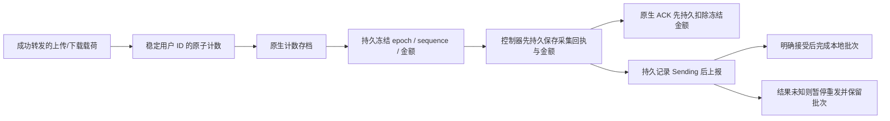

# Rust 原生计数持久化与停止协议

本文记录 nd3 持久化阶段的冻结验收；preview.2 保留这一状态格式，并补充 UDP、限速和来源 IP 名额。当前功能与新发行包测试见 [项目首页](../README.md)。下文协议范围、二进制哈希与未完成项属于该历史阶段；强杀尾部和真实计费边界仍适用。

本次补齐原生协议进程的计数存档。默认内置模式仍由一个 `xboard-node-rust` 程序文件运行控制进程与协议子进程，服务端不依赖 Go；协议范围继续是 VLESS TCP、VLESS 文件 TLS、Trojan 文件 TLS、direct 出站和系统域名解析。

之前的 acct4 版本保护已经采集进控制器队列的流量。本次在这之前增加周期存档，并保存原生 epoch、采集序号和冻结快照，使**已经落盘但尚未被控制器采集的计数也能恢复**。正常停止时先结束载荷转发，再保存和采集最后的计数；成功确认屏障后不会继续产生载荷字节。

这不构成网络写入与磁盘提交的联合事务。强杀、宿主机故障等情况下，最后一次成功存档之后的尾部仍可能丢失；默认一秒是调度间隔，实际窗口还包含调度、队列等待和文件系统同步时间。接口回执也不等于真实面板数据库已经完成最终计费。

## 数据怎样流转



周期存档不改变采集序号。采集时先冻结金额并写盘，再返回快照；未收到有效 ACK 时，重复查询返回同一个快照。控制器先提交采集回执和金额，再确认原生进程；原生进程先提交扣除冻结金额后的存档，再减内存计数。ACK 前后新转发的字节保留为下一批，重复 ACK 不重复扣除。

epoch 和序号随存档恢复，单纯重启不会把同一批计数当成新身份。尚未 ACK 的冻结快照也随重启恢复，与控制器的持久采集回执配合，避免重复累计。

## 状态文件与归属

文件都在同一个节点专属 `state_dir` 中：

| 文件 | 作用 |
| --- | --- |
| `native-traffic.json` | 原生 epoch、序号、非零用户计数、冻结快照和公平遍历游标 |
| `native-traffic.lock` | 原生写者的 OS 文件锁；进程退出释放锁，锁文件保留 |
| `traffic.json` | 控制器采集回执、待报金额、在途批次及确认状态 |
| `traffic.lock` | 控制器/离线队列操作的 OS 锁 |
| `candidate-*.json`、`u-*.sock` | 原有候选配置与私有控制入口 |

原生存档绑定不含 token 的面板/机器/节点标识摘要。不同目的地不能接着使用旧计数，第二个原生写者不能同时打开同一份存档。Linux 验证目录权限为 `0700`、普通状态文件为 `0600`；已有文件类型、权限、结构或目的地不符时拒绝启动，不静默重建空库。仅 `NotFound` 可用于初始化，其他读取错误直接返回。

写入采用独占创建临时文件、写入并 fsync、原子替换、目录 fsync。失败后存档对象停止接受后续写入，避免把未知磁盘状态当成成功。临时文件只清理本次创建并拥有的对象。Windows 模块测试不等于 Windows 已支持完整原生服务；当前完整运行依赖 Unix socket。

更换面板或节点归属应使用独立状态目录，并先处理旧队列；不能靠手工清空状态解决未确认交付。

## 正常停止与监听变更

控制器的停止顺序是：

1. 进入 closing 状态，停止新同步事务。
2. 请求原生 `traffic_quiesce`。原生关闭监听，取消并等待全部载荷任务结束，强制保存最后计数，然后才回复 `quiesced: true`。
3. 控制入口继续保留，允许采集和 ACK。控制器把最后批次提交到本地队列。
4. 结束原生进程。待报金额在下一次启动继续处理，不要求停机期间网络上报成功。

最后采集仍有界：最多 128 批，每批最多 512 行，开始下一次 RPC 前检查一秒预算，单次控制 RPC 为两秒。剩余已落盘金额由原生存档保留；这不是一秒内保证完成所有磁盘操作。屏障或最终采集失败会返回错误，并清理子进程，不输出“最后采集成功”。

存在原生存档时，监听、TLS 或协议候选替换会先结束旧写者，再打开新写者，避免两个进程争抢同一份计数。失败候选仍走已有恢复路径。仅用户变化继续原子发布认证表，不重启协议进程；已认证连接继续沿用原用户身份，删除用户只拒绝新认证。

## 慢磁盘下的调度与容量

元数据锁可能覆盖一次 fsync。认证预留、快照、ACK、checkpoint 和候选读取都在阻塞 worker 中执行，不在单线程异步执行器上同步等待计数锁。认证等待仍处于原十秒预算内，控制请求仍处于两秒预算内。

所有这些工作共用两个作业配额。配额移入实际 worker，直到工作真正结束才归还；异步调用被取消也不会提前释放配额。这样，慢磁盘下取消并重新创建连接，不会无限提交已经失去调用者的阻塞任务。该机制约束数量，不承诺能中断已经进入的操作系统磁盘同步。

## 配置

默认内置模式且开启统计时自动启用，无需额外指定协议程序路径。示例：

```json
{
  "panel_url": "https://panel.example.com",
  "token_env": "XBORD_PANEL_TOKEN",
  "machine_id": 1,
  "node_id": 7,
  "state_dir": "/var/lib/xbord-rust/7",
  "traffic_reporting": true,
  "report_seconds": 60,
  "traffic_checkpoint_ms": 1000
}
```

`traffic_checkpoint_ms` 的范围是 50–60000，默认 1000。较短间隔增加磁盘同步频率；不因改成 50 就承诺最多丢 50 毫秒。`traffic_reporting: false` 绕过原生载荷计数和存档。显式外部兼容模式不会自动获得本次原生存档能力。

离线 `--traffic-status` / `--traffic-resolve <真实批次号> delivered|not-delivered` 继续用于控制器队列的核对，详见 [流量统计与可靠上报](RUST_TRAFFIC_ZH.md)。它们不能代替面板核对，也不会把原生文件里的任意金额自动标记为已上报。

## 本版本直接验证

最终候选 nd3 绑定 60 个编译输入，清单 SHA256：

```text
9d9a55cf57b9187e9b92fae71e22282f84552a134af766cbf3b0b4217a980aa2
```

Linux ARM64 GNU ELF 为 4,462,520 字节，SHA256：

```text
c72d2f8cbe9c8eff500ae2268144958502c83f43e3bf968f6349a23da9417a51
```

比 acct4 的 4,331,448 字节增加 128 KiB，用于本次持久化和停止能力，不宣称二进制进一步缩小。需 glibc 2.39+ 与 libgcc_s。Windows 104 项、Linux ARM64 113 项 release workspace 测试通过，fmt 与严格 clippy 通过；workspace 忽略的外部真实 VLESS 回归在 Linux 单独执行并通过。Windows 最终运行使用 `--test-threads=1`；此前并发运行中已有挂起候选检查的四秒时限失败记录保留，未修改验收阈值。

新增五个实际客户端案例已通过：

| 案例 | 实际验收 |
| --- | --- |
| 原生进程 SIGKILL | 在控制器还没采集前已有原生周期存档，恢复后上传/下载各 131089 字节，未重复报告 |
| 控制器与原生进程同时 SIGKILL | 同样恢复尚未采集的已存档金额，epoch 保持 |
| 冻结快照后同时 SIGKILL | 序号 1 的冻结快照恢复，与控制器回执配合只累计一次 |
| 确认停止后最后采集 | 65539 字节双向回显；成功回复后监听关闭、旧连接结束、计数不再变化，最后金额进入队列并跨重启上报 |
| 更换监听端口 | 旧进程 32771 字节和新进程 8197 字节按各自用户恢复上报，epoch 保持，旧监听结束、新监听认证可用 |

这些案例由 `benchmarks/native_durable_lab.py` 执行，使用官方 sing-box 作为外部测试客户端；服务端是上述同一个 Rust ELF。只在隔离 HTTPS 面板夹具和回环监听中运行，没有写真实面板或替换现有服务。精确脚本、结果及其余回归的最终绑定见 [机器可读结果](../benchmarks/results/rust-native-durable-20261002.json)。独立审查签静态版本结论，业务 PASS 来自实际执行。

前两个强杀案例以读到原子替换后的文件为触发点。数据文件在替换前已 fsync，但“文件可见”不能证明随后目录 fsync 已返回；这些案例验证进程强杀后的恢复，不验证宿主机断电。冻结快照 RPC 和 quiesce 的成功回复才是各自完整存档流程的完成屏障。测试没有模拟断电、文件系统损坏或存储设备不遵守同步语义。

同一版本还完整复跑七个流量案例、原有三种原生协议各 64 条连接保持与 2 MiB 跨更新内容、四类控制故障、256 条连接/1024 次内容校验传输、进程恢复与监听变更，以及两轮仅测试子进程的 64FD 耗尽。资源对照运行关闭统计；其 CPU/RSS 采样不能证明本次统计开启后的开销下降。FD 案例使用未启用持久库的直接协议运行，不能当作磁盘错误下的综合压力验收。

停止案例在完整回显后保留一个空闲连接，验证它在确认停止后结束；没有对持续不停写、背压满载或强行 drain 期间的任意载荷排列作无损承诺。单写者的文件锁由模块测试直接验证，监听代际案例的实际运行与源码顺序共同支持单写者重启结论。

## 仍需继续迁移

周期存档不能消除尚未提交的强杀尾部。真实面板异步计费对账、限速和设备/IP 限制、其他协议、路由/DNS 策略、多节点，以及控制器配置的持久恢复仍未完成。回环、短时连接和资源采样也不证明 WAN 速度、最大 TCP 承载或长期生产稳定性。

本版本保持原始 Go 源码和旧交付，但新源码/二进制包只包含 Rust 产品、匹配源码、验证材料和依赖许可。项目 Rust 代码继续 MPL-2.0；没有改许可证、Git 提交、推送或生产替换。
