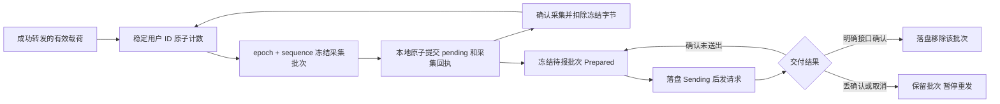

# Rust 用户流量统计与持久上报队列

本文保留 TCP 记账片段的历史实现和测试记录。当前 preview.2 延续相同持久状态格式，并把相同成功载荷计数用于 UDP（不计分包头与被过滤的来源）；已新增限速和来源 IP 限制。最新支持范围与发行测试见 [项目首页](../README.md)。下文“后续”描述属于当时阶段。

这个片段补齐当前 Rust TCP 数据层的按用户流量来源，以及控制进程的本地待报队列。仍是单节点实验实现：生产面板的实际账单、完整限速/设备限制、其他协议和配置的持久恢复继续迁移。

## 统计什么

上传表示成功写给目标服务器的字节，下载表示成功写给客户端的字节。统计发生在协议认证和 TLS 解封装之后，排除 VLESS/Trojan 握手头、VLESS 响应头、TLS 封装、TCP/IP 开销。实际承载的 HTTP 或其他应用协议头也是有效载荷，会计入；这里不是“文件净大小”统计。

计数随着成功的写入立即增加，连接未结束也能采集。短写只计实际成功的长度；写入失败、取消、半关闭之前已经成功转发的字节继续保留。用户按稳定面板 ID 标识，用户列表重排或删除不会把旧连接的流量记给另一位用户；删除仍允许已认证连接继续，这是当前热更新语义。

默认内置 Rust 模式同时启用统计与上报。`traffic_reporting:false` 会关闭该模式的计数和 HTTP 上报，不删除此前的本地队列。显式外部内核方式不启用此功能，不能用外部内核的进程存活代替流量来源验证。

```json
{
  "panel_url": "https://panel.example.com",
  "token_env": "XBORD_PANEL_TOKEN",
  "node_id": 7,
  "machine_id": 1,
  "state_dir": "/var/lib/xb-rust",
  "poll_seconds": 30,
  "report_seconds": 60,
  "traffic_reporting": true,
  "websocket": true
}
```

`poll_seconds` 和 `report_seconds` 均为 1–3600 秒。同步配置前会额外采集一次；HTTP 上报独立按上报周期触发。状态指标 `traffic_collected/traffic_reports/traffic_uncertain` 是本次进程的批次数，不能当作账单或跨重启累计流量。

## 数据怎样保存



原生内核每次启动生成新的随机 epoch，同一 epoch 的采集序号递增。控制端先将字节和采集回执同次落盘，再确认内核；确认丢失时重新读取的是同一批次，控制端不会再次累计。回执同时绑定内容摘要，相同序号却改变内容、跳过序号或非规范的面板用户 ID 会被拒绝。

`state_dir/traffic.json` 保存目的面板、节点身份、待报字节、采集回执和一个在途批次，不保存 token、密码、UUID、证书或实际载荷。它绑定面板 URL、node_id、machine_id/node_type；不能把旧节点的文件直接拿去为另一节点上报。Linux 目录为 0700，文件为 0600，原子替换前同步文件，之后同步目录。`traffic.lock` 使用 OS 文件锁，防止同一目录被两个控制进程同时记账；崩溃后 OS 释放锁，不靠删除锁文件抢占。Windows 验证覆盖格式和状态机，实际原生运行及目录同步语义以 Linux 验证为准。

采集与报告每批最多 512 位用户，两个方向使用 u64 本地累计，超出面板 i64 范围会分批发送而不发生符号回绕。原生采集与持久报告都轮询取批，低 ID 热点用户不会一直挤占历史高 ID 用户。原生计数表及 pending 各最多 65,536 位用户，回执最多 4,096 个内核 epoch，日志文件最多 32 MiB。达到边界或溢出时明确报错，不静默清空、忽略或伪造计数。当前没有自动删减回执和自动轮转，接近边界时需进一步提供审核式维护方案。

## 上报与不确定结果

请求为 `POST /api/v2/server/report`，JSON `traffic` 使用 `"用户ID":[上传,下载]`，认证字段放在请求体；本次流量报告不伪造 CPU、内存、在线人数等尚未采集的数据。

成功合同绑定 [XBoard 的 v2 report 实现](https://github.com/cedar2025/Xboard/blob/4f48e61a2cbc6db5338872b6bdb45ef954ec1256/app/Http/Controllers/V2/Server/ServerController.php)：完整 HTTP 200 且 JSON 恰为 `{"data":true}`。空对象、HTML 登录页、`data:false`、业务错误、错误状态码或响应未收完都不清除在途批次。该确认代表接口接受，不能替代后台异步处理或计费数据库的最终对账；不同面板分支仍需真实兼容验证。

HTTP 客户端关闭隐式自动重试。确认连接建立失败或请求构建失败时，批次回到 Prepared，下一周期可再发送。请求已可能送到服务端后的超时、断开或取消进入 Uncertain；发送中崩溃后重开也进入 Uncertain。这个批次暂停自动发送，新的采集数据仍可落盘排队。没有服务端批次去重合同，不能保证整个系统“恰好计费一次”，也不能把超时一律当作未送出。

停止节点后查看本地情况，无需 token，也不会访问面板：

```bash
xboard-node-rust --config runtime.json --traffic-status
```

输出保留完整的 `pending` 和 `batch` 原始字段，并额外提供 `summary` 供脚本或 Bot 直接读取：`state` 可能是 `idle`、`pending`、`prepared`、`sending` 或 `uncertain`；`pending_bytes` / `batch_bytes` 是上传、下载合计，`*_users` 是对应用户数。只有 `requires_reconciliation:true` 时才表示必须先核对面板，再按 `next_action` 的提示执行 `--traffic-resolve`；摘要不会替你判断面板是否已处理。

核对该批次用户、字节和实际面板记录，确认已经处理后标记已送达；确认未处理后才允许再发。命令里的 `123` 必须换成状态输出中真实的批次 ID：

```bash
xboard-node-rust --config runtime.json --traffic-resolve 123 delivered
xboard-node-rust --config runtime.json --traffic-resolve 123 not-delivered
```

这两个命令只修改本地在途批次，不能替人判断服务端是否处理。节点运行时 OS 锁会拒绝另一个进程修改队列。磁盘写入失败后本进程停止队列写入，避免覆盖可能已经替换成功但目录同步失败的未知状态；修复存储后重开并核对持久文件。

## 仍有的丢失窗口

已采集并 fsync 提交的数据能够跨控制端重开保存；原生内核的尚未采集数据仍在内存。SIGKILL、异常退出、监听/协议/TLS 重启和未知状态恢复均可能丢失这部分数据。

正常停止会尽力采集多批：最多 128 批，开始下一批前检查 1 秒预算，单次 RPC 本身最多 2 秒；磁盘同步耗时也受实际文件系统影响。达到预算、RPC/存储失败、仍在传输的连接及采集到终止之间的新字节都可能留下未采集数据。配置重启前的额外采集也有每批 512 用户上限。当前没有数据层静止屏障、全量崩溃日志或持久化内核计数，不能宣称正常停止、机器掉电或任何强杀下全部字节无损。

后续优先补数据层持久计数/可验证的静止与退出协议，再与真实面板对账；限速、设备限制、其他协议和多节点是后续能力，当前不伪造实现状态。

## 验证入口

源码测试覆盖实际部分写入、失败、半关闭、启用/关闭统计、快照确认丢失、epoch 重置、队列恢复、错误响应、公平调度、大数分批、并发锁、目标绑定、文件错误及多批停止采集。

`benchmarks/traffic_lab.py` 在 Linux 用官方 sing-box 作为外部测试客户端，Rust 二进制承担服务端；HTTPS 面板、origin、用户和 token 均为隔离夹具。完整运行后通过独立的机器可读结果记录真实字节对账、丢确认/取消/强杀恢复、未送出重试及前序协议回归。构建或接口响应单独不能替代这些测试，也不能证明生产计费。
